# ENGSE207 Software Architecture  
## README — Final Lab Set 1: Microservices + HTTPS + Lightweight Logging

---

## 1. ข้อมูลรายวิชาและสมาชิก

**รายวิชา:** ENGSE207 Software Architecture  
**ชื่องาน:** Final Lab — ชุดที่ 1: Microservices + HTTPS + Lightweight Logging  

**สมาชิกในกลุ่ม**
- นาย ภานุวัฒน์ ต๋าคำ / รหัสนักศึกษา: 67543210044-3
- นาย เอกพันธ์ ทศทิศรังสรรค์ / รหัสนักศึกษา: 67543210050-0

**Repository:** `final-lab-set1/`

---

## 2. ภาพรวมของระบบ

Final Lab ชุดที่ 1 เป็นการพัฒนาระบบ Task Board แบบ Microservices โดยเน้นหัวข้อสำคัญดังนี้

- การทำงานแบบแยก service (Auth, Task, Log)
- การใช้ Nginx เป็น API Gateway (Reverse Proxy)
- การเปิดใช้งาน HTTPS ด้วย Self-Signed Certificate
- การยืนยันตัวตนด้วย JWT (Authentication)
- การจัดเก็บ log แบบ Lightweight Logging ผ่าน Log Service ลง PostgreSQL
- การเชื่อมต่อ Frontend กับ Backend ผ่าน HTTPS โดยใช้ Relative Path

งานชุดนี้ **ไม่มี Register** และใช้เฉพาะ **Seed Users** (Alice, Bob, Admin) ที่กำหนดไว้ในฐานข้อมูล

---

## 3. วัตถุประสงค์ของงาน

- ออกแบบระบบแบบ Microservices ที่มีการแยกส่วนความรับผิดชอบชัดเจน
- ฝึกการใช้ Nginx เพื่อทำ TLS Termination และจัดการ Routing
- เข้าใจการใช้ JWT ในการรักษาความปลอดภัยของ API ระหว่าง Microservices
- พัฒนาระบบ Logging ส่วนกลางเพื่อมอนิเตอร์เหตุการณ์ภายในระบบ
- ฝึกการใช้ Docker Compose ในการจัดการ Service จำนวนมากในสภาพแวดล้อมจำลอง

---

## 4. Architecture Overview

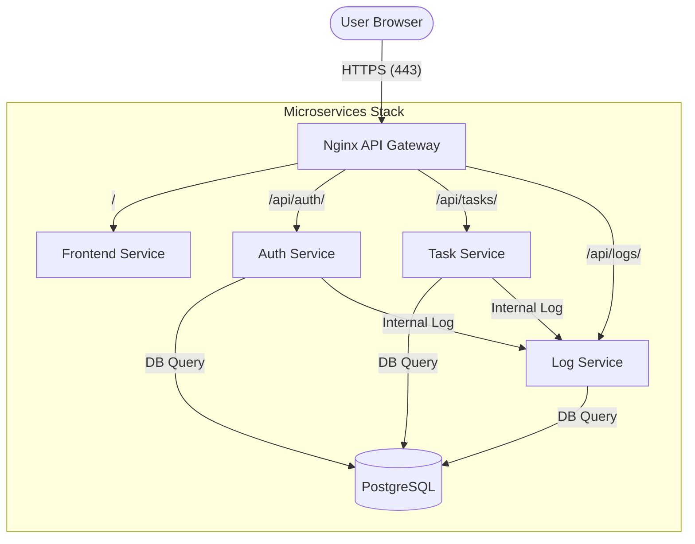

### Services ที่ใช้ในระบบ
- **nginx** — ทำหน้าที่เป็น API Gateway จัดการ HTTPS, Rate Limiting และ Reverse Proxy
- **frontend** — ให้บริการไฟล์ Static (HTML/CSS/JS) สำหรับหน้า Task Board และ Log Dashboard
- **auth-service** — จัดการระบบ Login, Verify Token และให้ข้อมูลผู้ใช้ปัจจุบัน (Me)
- **task-service** — จัดการ CRUD งาน (Tasks) พร้อมระบบสิทธิ์การเข้าถึงข้อมูล
- **log-service** — รวบรวม Log จากทุก Service และคำนวณสถิติสำหรับ Admin
- **postgres** — ฐานข้อมูลกลางสำหรับจัดเก็บข้อมูล Users, Tasks และ Logs

---

## 5. โครงสร้าง Repository

```text
final-lab-set1/
├── README.md
├── TEAM_SPLIT.md
├── INDIVIDUAL_REPORT_67543210044-3.md
├── INDIVIDUAL_REPORT_67543210050-0.md
├── docker-compose.yml
├── .env
├── nginx/
│   ├── nginx.conf
│   └── certs/
├── frontend/
│   ├── index.html
│   └── logs.html
├── auth-service/
├── task-service/
├── log-service/
├── db/
│   └── init.sql
├── scripts/
│   └── gen-certs.sh
└── screenshots/
```

---

## 6. เทคโนโลยีที่ใช้

- **Backend**: Node.js / Express.js
- **Database**: PostgreSQL
- **Gateway**: Nginx
- **Containerization**: Docker / Docker Compose
- **Security**: JWT, bcryptjs, SSL/TLS (OpenSSL)
- **Frontend**: Vanilla JavaScript / HTML / CSS

---

## 7. การตั้งค่าและการรันระบบ

### 7.1 สร้าง Self-Signed Certificate
ต้องสร้าง Certificate ก่อนเพื่อให้ Nginx รัน HTTPS ได้:
```bash
chmod +x scripts/gen-certs.sh
./scripts/gen-certs.sh
```

### 7.2 สร้างไฟล์ `.env`
กำหนดค่าเชื่อมต่อฐานข้อมูลและ JWT Secret:
```env
POSTGRES_DB=taskboard
POSTGRES_USER=admin
POSTGRES_PASSWORD=secret123
JWT_SECRET=engse207-super-secret-change-in-production-abc123
JWT_EXPIRES=1h
```

### 7.3 รันระบบ
```bash
docker compose up --build -d
```

### 7.4 เปิดใช้งานผ่าน Browser
- **Task Board**: [https://localhost](https://localhost)
- **Log Dashboard**: [https://localhost/logs.html](https://localhost/logs.html) (ต้อง Login เป็น Admin)

---

## 8. Seed Users สำหรับทดสอบ

| Username | Email | Password | Role |
|---|---|---|---|
| alice | alice@lab.local | alice123 | member |
| bob | bob@lab.local | bob456 | member |
| admin | admin@lab.local | adminpass | admin |

---

## 9. API Summary

### Auth Service
- `POST /api/auth/login` - เข้าสู่ระบบและรับ JWT
- `GET /api/auth/verify` - ตรวจสอบความถูกต้องของ Token
- `GET /api/auth/me` - ดึงข้อมูลผู้ใช้ปัจจุบัน

### Task Service
- `GET /api/tasks/` - ดูรายการงาน (Member เห็นเฉพาะของตน, Admin เห็นทั้งหมด)
- `POST /api/tasks/` - สร้างงานใหม่
- `PUT /api/tasks/:id` - แก้ไขงาน (เฉพาะเจ้าของหรือ Admin)
- `DELETE /api/tasks/:id` - ลบงาน (เฉพาะเจ้าของหรือ Admin)

### Log Service
- `POST /api/logs/internal` - บันทึก Log จาก Service อื่น (จำกัดสิทธิ์ภายใน)
- `GET /api/logs/` - ดูรายการ Log ทั้งหมด (Admin Only)
- `GET /api/logs/stats` - ดูสถิติ Log (Admin Only)

---

## 10. การทดสอบด้วย CLI (curl)

สามารถทดสอบ Login และดึงข้อมูลงานผ่าน curl ได้ดังนี้:

```bash
```bash
# 1. Login และดึง Token
TOKEN=$(curl -k -s -X POST https://localhost/api/auth/login \
  -H "Content-Type: application/json" \
  -d '{"email":"alice@lab.local","password":"alice123"}' | grep -oP '"token":"\K[^"]+')

# 2. ดึงข้อมูลงานโดยใช้ Token
curl -k https://localhost/api/tasks/ -H "Authorization: Bearer $TOKEN"
```

---

## 11. Screenshots ผลการทดสอบ

### 11.1 การรันระบบด้วย Docker Compose
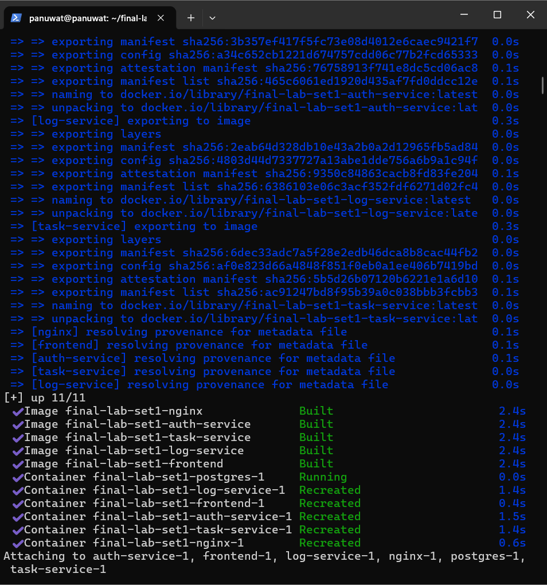
*แสดงสถานะคอนเทนเนอร์ทั้งหมด 6 ตัวทำงานปกติและ Healthy*

### 11.2 การเข้าใช้งานผ่าน HTTPS
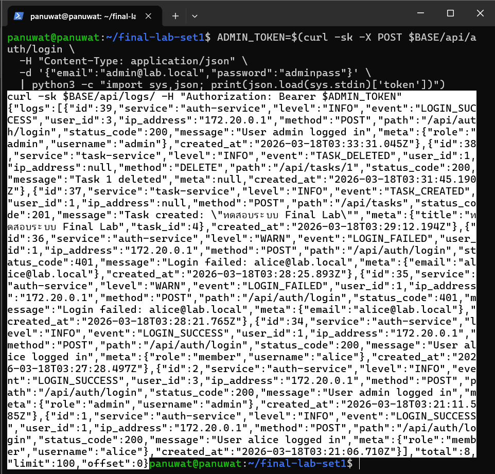
*หน้าจอ Log Dashboard เมื่อเข้าใช้งานผ่าน HTTPS และ Login ด้วยสิทธิ์ Admin*

### 11.3 การทดสอบ API Login (Success & Fail)
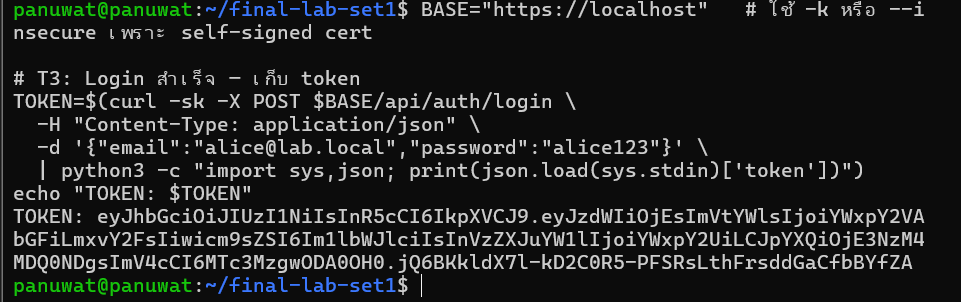
*การ Login สำเร็จและได้รับ JWT Token*

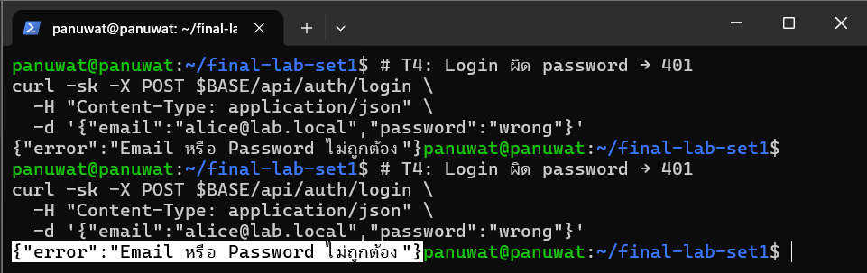
*การ Login ล้มเหลวเมื่อใส่รหัสผ่านผิด (401 Unauthorized)*

### 11.4 การจัดการ Task (CRUD)
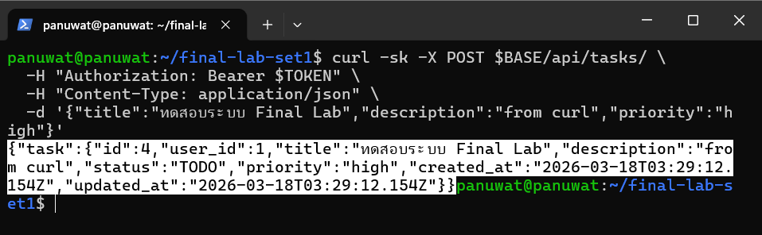
*การสร้าง Task ใหม่ผ่าน API*

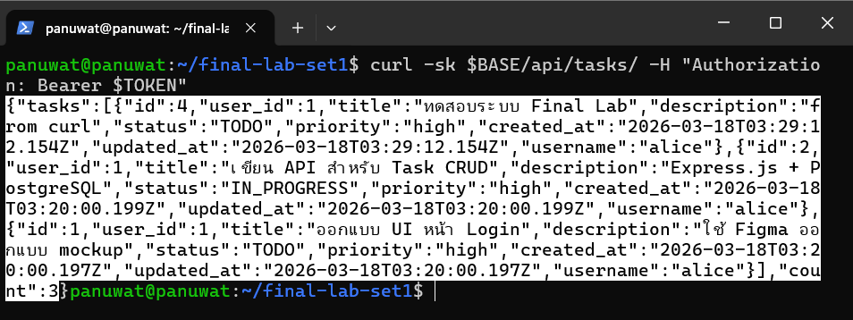
*การเรียกดูรายการ Task ทั้งหมด*

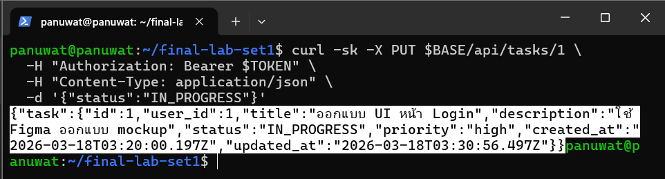
*การแก้ไขข้อมูล Task*

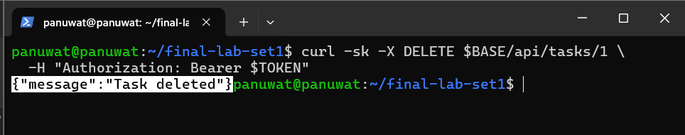
*การลบ Task ออกจากระบบ*

### 11.5 การทดสอบความปลอดภัยและข้อจำกัด
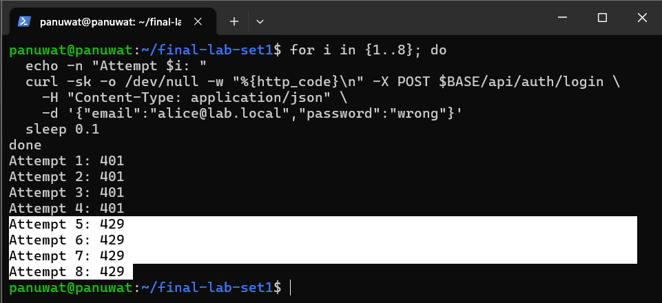
*การทำงานของ Rate Limiting (429 Too Many Requests) เมื่อ Login เกินกำหนด*

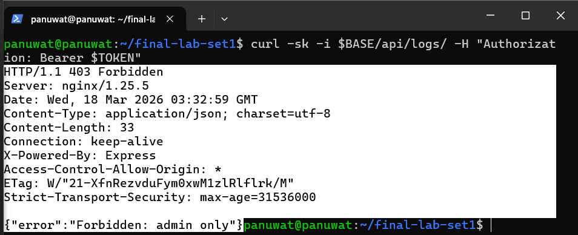
*Nginx บล็อกการเข้าถึง API ภายในจากภายนอก (403 Forbidden)*

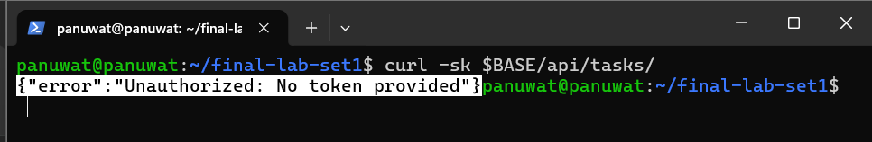
*การเข้าถึง API ที่ป้องกันไว้โดยไม่มี Token (401 Unauthorized)*

---

## 12. การแบ่งงานของทีม

รายละเอียดอยู่ในไฟล์:
- [TEAM_SPLIT.md](./TEAM_SPLIT.md)
- [INDIVIDUAL_REPORT_67543210044-3.md](./INDIVIDUAL_REPORT_67543210044-3.md)
- [INDIVIDUAL_REPORT_67543210050-0.md](./INDIVIDUAL_REPORT_67543210050-0.md)

---

## 12. ปัญหาที่พบและแนวทางแก้ไข

1.  **ปัญหา HTTP Redirect**: ในตอนแรก Nginx ไม่ทำการ Redirect อย่างถูกต้อง
    - **วิธีแก้**: ตรวจสอบ config และเพิ่มบล็อก `listen 80` พร้อมระบุ `return 301 https://$host$request_uri;`
2.  **ปัญหาการแสดง Username**: Task Service แสดงผลเฉพาะ `user_id` ทำให้หน้าเว็บดูยาก
    - **วิธีแก้**: แก้ไข SQL Query ให้ใช้การ `JOIN` ตาราง `users` เพื่อดึงฟิลด์ `username` มาใช้
3.  **ปัญหา Rate Limiting**: ตัวนับของ Nginx ทำงานไวเกินไปสำหรับช่วงพัฒนา
    - **วิธีแก้**: ปรับค่า `burst` และ `nodelay` ใน Nginx Config เพื่อให้ยืดหยุ่นขึ้นแต่ยังคงความปลอดภัยไว้ได้

---

## 13. ข้อจำกัดของระบบ

- ใช้ **Self-signed Certificate** ทำให้ Browser แจ้งเตือนความปลอดภัย (Security Warning)
- ใช้ **Shared Database** เพียงตัวเดียวเพื่อความง่ายในแล็บนี้ (ในระบบจริงควรแยก Database-per-service)
- ฟีเจอร์ **Logging** เป็นแบบ Lightweight บันทึกลง PostgreSQL (ไม่ใช่ระบบ Observability เต็มรูปแบบเช่น ELK Stack)

---

> จัดทำขึ้นเพื่อประกอบการส่งงาน Final Lab Set 1 ในรายวิชา ENGSE207 Software Architecture
